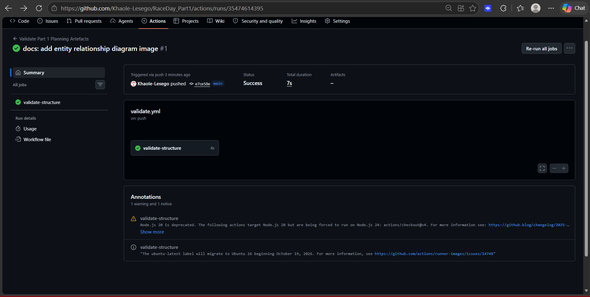

# RaceDay - Event Management System

**Module:** Programming 2B (PROG6212)  
**Assessment:** Portfolio of Evidence - Part 1: System Planning and Database  
**Student:** Lesego Khaole  
**Student number:** ST10455441

## Project overview

RaceDay is a planned web-based event management system for South African road-running, walking, and cycling events. It replaces paper registrations, spreadsheet-based administration, and fragmented participant communication with a single platform for event creation, category management, enrolments, results, route information, and participant performance history.

Part 1 contains planning artefacts only. No C# or API implementation is included. The documents in `docs/` are the baseline specification for the Part 2 REST API and the Part 3 MVC application.

## Roles

| Role        | Planned capabilities                                                                                                                                                      |
| ----------- | ------------------------------------------------------------------------------------------------------------------------------------------------------------------------- |
| Organiser   | Creates, updates, and removes owned events; manages event categories and route information; views enrolments for owned events; captures and corrects participant results. |
| Participant | Registers and maintains a personal profile; browses events and categories; enrols in an event; views personal enrolments and results.                                     |

The API will enforce role and ownership checks server-side in Part 2. A participant cannot administer an event, and an organiser cannot retrieve another organiser's private event-management data.

## Contents

| Path                                                                   | Purpose                                                                                   |
| ---------------------------------------------------------------------- | ----------------------------------------------------------------------------------------- |
| [`docs/RaceDay_ERD.png`](docs/RaceDay_ERD.png)                         | Visual entity relationship diagram with attributes, keys, and relationship cardinalities. |
| [`docs/ERD_Specification.md`](docs/ERD_Specification.md)               | Accessible ERD data dictionary, Mermaid source, constraints, and rationale.               |
| [`docs/API_Endpoint_Plan.md`](docs/API_Endpoint_Plan.md)               | REST endpoint specification prepared before implementation.                               |
| [`docs/RaceDay_Database_Script.sql`](docs/RaceDay_Database_Script.sql) | SQL Server schema and realistic seed data.                                                |
| [`.github/workflows/validate.yml`](.github/workflows/validate.yml)     | Repository-structure validation workflow.                                                 |

## Running the database script in SSMS

1. Open **SQL Server Management Studio** and connect to a SQL Server instance on which you may create databases.
2. Open `docs/RaceDay_Database_Script.sql`.
3. Execute the complete script. It creates the `RaceDay` database, tables, constraints, lookup values, and sample records.
4. Run the verification queries at the bottom of the script. They should return seven tables, three events, six categories, four enrolments, two results, and three route-information records.

The script is safe to run more than once: it drops and recreates the RaceDay tables (in reverse foreign-key order) before reseeding, so re-running it during a live demo will not fail with "object already exists" errors.

## ERD design decisions

The schema has seven entities: `User`, `EventType`, `Event`, `Category`, `Enrolment`, `Result`, and `RouteInfo`. `Enrolment` resolves the many-to-many relationship between participants and events, while `Result` is constrained to one record per enrolment. `RouteInfo` has a unique `EventId`, producing one route-information record per event in the planned data model. `BannerImageUrl` and `ProfilePictureUrl` reserve storage locations for the Part 3 Azure Blob Storage feature without creating a separate image table.

One `User` table supports both roles. The foreign keys alone cannot prove that `OrganiserId` belongs to an Organiser or that `ParticipantId` belongs to a Participant; Part 2 must validate both the authenticated user's role and resource ownership before accepting a request.

`Category` supports age-based categories, distance-based categories, or both, via a nullable `DistanceKm` column alongside `MinAge`/`MaxAge`. A category's distance may legitimately differ from its event's headline `Distance`, since one event can offer more than one distance (e.g. a family 5 km alongside a 10 km main route).

The ERD specification, SQL script, and endpoint plan are internally aligned: the same table names, column names, data types, and constraints appear in all three documents. The only deliberate difference between the ERD image and the SQL script is that the exported PNG includes the `Category.DistanceKm` attribute so the diagram matches the specification exactly.

## CI/CD evidence

A GitHub Actions workflow runs on every push and pull request. It validates that all required planning artefacts exist and are non-empty:

- `docs/RaceDay_ERD.png`
- `docs/ERD_Specification.md`
- `docs/API_Endpoint_Plan.md`
- `docs/RaceDay_Database_Script.sql`
- `README.md`

The workflow definition lives at [`.github/workflows/validate.yml`](.github/workflows/validate.yml). A screenshot of a successful run is stored at `docs/images/part1-validation-green-build.png`.

## Video presentation

The unlisted YouTube walkthrough demonstrates the planning documents, explains the ERD and endpoint plan decisions, and shows the SQL script running live in SSMS.

- Part 1 planning walkthrough: [PROG6212 Part 1 Video](https://youtu.be/GeyyuPqVkp4)

## AI usage disclosure

AI coding assistants were used during this Part 1 submission for the following purposes:

- Clarifying entity relationship and normalisation concepts while planning the ERD.
- Reviewing the SQL script and ERD specification for consistency errors.
- Structuring and proofreading portions of this README.

## Tools used

- **draw.io** (or an equivalent ERD tool) for producing the entity relationship diagram.
- **Microsoft SQL Server Management Studio (SSMS)** for executing and verifying the database script.
- **Visual Studio 2022** is planned for the Part 2 and Part 3 solutions.
- **Git and GitHub** for version control and CI/CD.

## References

Draw.io (2026) _Diagram software and flowcharts_. Available at: https://www.drawio.com/ (Accessed: 20 September 2026).

GitHub (2026) _GitHub Actions documentation_. Available at: https://docs.github.com/en/actions (Accessed: 20 September 2026).

Microsoft (2026) _SQL Server technical documentation_. Available at: https://docs.microsoft.com/en-us/sql/sql-server/ (Accessed: 20 September 2026).

Satzinger, J.W., Jackson, R.B. and Burd, S.D. (2016) _Systems analysis and design in a changing world_. 7th edn. Boston, MA: Cengage Learning.

Microsoft (2023) REST API Guidelines. Available at: https://github.com/microsoft/api-guidelines (Accessed: 20 September 2026).

Richardson, L., Amundsen, M. and Ruby, S. (2013) RESTful Web APIs. Sebastopol, CA: O'Reilly Media.

Troelsen, A. and Japikse, P. (2021) Pro C# 10 with .NET 6: Foundational principles and practices in programming. 11th edn. Berkeley, CA: Apress.
